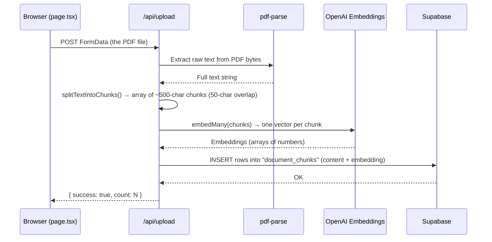
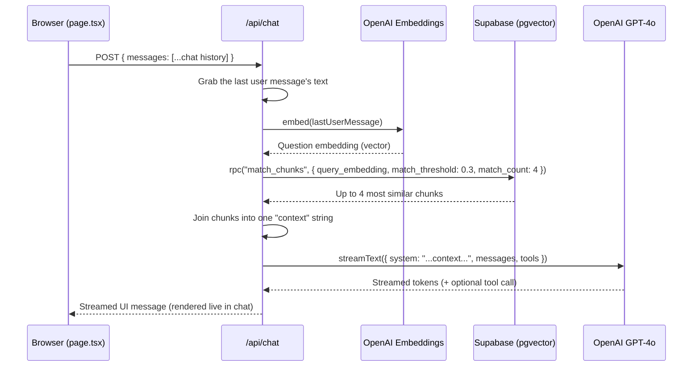

# 📄 Document & Knowledge Assistant

A small web app where you **upload a PDF** and then **chat with it** — you ask questions, and an AI answers using only the content of that PDF. This is a classic **RAG** app (Retrieval-Augmented Generation).

---

## 1. The big idea

Normal AI chatbots (like plain ChatGPT) only know what they were trained on — they've never seen _your_ PDF. This app fixes that by:

1. Reading your PDF and breaking it into small text chunks.
2. Converting each chunk into a list of numbers (an **embedding**) that represents its _meaning_.
3. Storing those chunks + numbers in a database (Supabase).
4. When you ask a question, it converts your question into numbers too, finds the chunks whose numbers are most "similar" (closest meaning), and hands those chunks to the AI as **context**.
5. The AI then answers your question using only that context.

This is why the AI can answer questions about a document it was never trained on — it "cheats" by being handed the relevant paragraphs right before answering.

---

## 2. High-level architecture

```mermaid
flowchart LR
    U["🧑 User (Browser)"] -->|"1. Upload PDF"| UP["/api/upload"]
    U -->|"4. Ask a question"| CH["/api/chat"]
npm test -- --run  # run the Vitest suite once


## 12. Test checklist for changes

    UP -->|"2. Extract text + split into chunks"| PARSE["pdf-parse"]
    UP -->|"3. Turn chunks into embeddings"| EMB1["OpenAI Embeddings API"]
    UP -->|"4. Save chunks + embeddings"| DB[("Supabase\n(Postgres + pgvector)")]

    CH -->|"5. Turn question into embedding"| EMB2["OpenAI Embeddings API"]

    CH -->|"6. Find similar chunks (match_chunks)"| DB
    CH -->|"7. Send question + matched chunks"| LLM["OpenAI GPT-4o"]
    LLM -->|"8. Streamed answer"| CH
    CH -->|"9. Streamed answer"| U
```

- **Frontend**: one page (`app/page.tsx`) — upload box + chat window.
- **Backend**: two Next.js API routes — `/api/upload` and `/api/chat`.

## 13. Key concepts explained (glossary)

- **AI provider**: OpenAI, for both embeddings and the chat model.

---

## 3. Tech stack

| Layer       | Technology                                                                     | Why it's used                                                           |
| ----------- | ------------------------------------------------------------------------------ | ----------------------------------------------------------------------- |
| Framework   | [Next.js 16](https://nextjs.org/) (App Router)                                 | Full-stack React framework — pages + API routes in one project          |
| UI          | React 19, Tailwind CSS v4, shadcn/ui, lucide-react icons                       | Pre-built accessible components (`Button`, `Card`, `Input`) + icons     |
| AI SDK      | [Vercel `ai` SDK](https://sdk.vercel.ai/) + `@ai-sdk/react` + `@ai-sdk/openai` | Standardized way to stream chat messages and call LLMs/embedding models |
| AI Model    | OpenAI `gpt-4o` (chat) + `text-embedding-3-small` (embeddings)                 | Generates answers and turns text into vectors                           |
| PDF parsing | `pdf-parse`                                                                    | Extracts raw text out of an uploaded PDF                                |
| Database    | Supabase (Postgres + `pgvector`)                                               | Stores document chunks and their embeddings, and runs similarity search |
| Validation  | `zod`                                                                          | Validates the shape of AI tool inputs                                   |
| Language    | TypeScript                                                                     | Type safety across frontend and backend                                 |

---

## 4. Folder structure

```
document-assistant/
├─ app/
│  ├─ layout.tsx        → Root HTML layout (fonts, <html>/<body>, page title)
│  ├─ page.tsx           → The ONLY page: upload UI + chat UI (client component)
│  ├─ globals.css        → Tailwind + theme styles
│  └─ api/
│     ├─ upload/route.ts → POST: receives PDF → parses → chunks → embeds → stores
│     └─ chat/route.ts   → POST: receives chat messages → retrieves context → streams AI answer
├─ components/ui/        → Reusable UI primitives (shadcn/ui): button, card, input
├─ lib/utils.ts           → Small helper (`cn`) for merging Tailwind classes
├─ public/                → Static assets
├─ next.config.ts         → Next.js config (PDF parsing needs special bundling settings)
├─ components.json        → shadcn/ui configuration (style, aliases, icon library)
└─ .env.local             → Secret keys (OpenAI + Supabase) — NEVER commit this file
```

---

## 5. Step-by-step: what happens when you upload a PDF

**File involved:** [app/api/upload/route.ts](app/api/upload/route.ts)



Explained simply:

- **Text extraction**: `pdf-parse` reads the PDF's raw bytes and pulls out plain text (like copy-pasting all the words out of the PDF).
- **Chunking** (`splitTextIntoChunks`): the AI can't process a 50-page document all at once effectively, so the text is cut into small overlapping pieces:
  - `chunkSize = 500` characters per chunk.
  - `chunkOverlap = 50` characters shared between consecutive chunks (so a sentence that gets cut in half isn't lost — it also appears in the next chunk).
- **Embedding** (`embedMany`): each chunk of text is sent to OpenAI's `text-embedding-3-small` model, which returns a **vector** — a list of a few hundred numbers that mathematically represents the _meaning_ of that text. Similar meanings → similar numbers.
- **Storing**: each `{ content, embedding }` pair is inserted as a row into a Supabase table called `document_chunks`.

> Uploads are tracked as documents. Each chunk belongs to one `document_id`, and deleting a document also deletes its chunks through the database foreign key.

### Document lifecycle

Sprint 2 adds a `documents` table and these statuses:

- `processing`: the PDF is being parsed and indexed.
- `ready`: the document can be selected for chat.
- `failed`: indexing stopped; the error is shown safely without exposing database details.

Apply `supabase/migrations/20260924120000_document_lifecycle.sql` before using the new upload and document APIs. The migration removes old chunks that have no reliable document owner, because assigning them to an arbitrary document could mix unrelated PDFs.

The document API is:

- `GET /api/documents` — list documents and chunk counts.
- `PATCH /api/documents/:id` — rename a document without re-indexing it.
- `DELETE /api/documents/:id` — remove the document and its chunks.

Chat requests must include the selected `documentId`, so retrieval is limited to that document.

---

## 6. Step-by-step: what happens when you ask a question

**File involved:** [app/api/chat/route.ts](app/api/chat/route.ts)



Explained simply:

- **Embed the question**: same trick as before — the user's question is turned into a vector.
- **Similarity search** (`supabase.rpc("match_chunks", ...)`): this calls a Postgres **function** (defined inside Supabase, not in this repo's code) that uses `pgvector` to find the chunks whose embeddings are mathematically closest to the question's embedding — i.e., "which parts of the document are most relevant to this question?"
  - `match_threshold: 0.3` → only chunks similar enough are returned.
  - `match_count: 4` → return at most 4 chunks.
- **Build context**: the matched chunks' text is joined together with `\n---\n` and inserted into the AI's **system prompt**, together with an instruction: _"Only answer based on this context. If the answer isn't there, say the information is missing."_ This instruction is what stops the AI from making things up outside the document (reduces hallucination).
- **Streaming answer**: `streamText` calls GPT-4o and streams the answer back token-by-token, so the browser sees the text appear gradually instead of waiting for the whole reply.
- **Tool calling** (`getSummaryCard`): the AI has an extra "tool" it can decide to use — if the user seems to be asking for a _summary_, GPT-4o can call this tool with a title + bullet points, and the frontend renders that as a nice summary card in the chat instead of plain text. This uses `zod` to strictly define what shape the tool's input must have.

---

## 7. The database (Supabase / pgvector)

This project relies on a Supabase Postgres database with the [`pgvector`](https://github.com/pgvector/pgvector) extension enabled. That part is **configured directly in your Supabase project**, not in this repo. Based on how the code uses it, you need something like:

```sql
-- 1. Enable the vector extension
create extension if not exists vector;

-- 2. Table that stores each text chunk + its embedding
create table document_chunks (
  id bigint generated always as identity primary key,
  content text not null,
  embedding vector(1536) -- text-embedding-3-small produces 1536 numbers
);

-- 3. Function used by /api/chat to find similar chunks
create or replace function match_chunks (
  query_embedding vector(1536),
  match_threshold float,
  match_count int
)
returns table (id bigint, content text, similarity float)
language sql stable
as $$
  select
    id,
    content,
    1 - (embedding <=> query_embedding) as similarity
  from document_chunks
  where 1 - (embedding <=> query_embedding) > match_threshold
  order by similarity desc
  limit match_count;
$$;
```

> `<=>` is pgvector's **cosine distance** operator — it measures how "far apart" two vectors point. `1 - distance` turns that into a 0–1 "similarity" score (1 = identical meaning).

---

## 8. The frontend UI

**File:** [app/page.tsx](app/page.tsx) — this is a **client component** (`"use client"`) meaning it runs in the browser and can use React state/hooks.

- **`useChat` hook** (from `@ai-sdk/react`): manages the whole chat conversation — messages array, sending messages, and connection status (`ready`, `submitted`, `streaming`, etc.). It's wired to call `/api/chat` via `DefaultChatTransport`.
- **Upload card**: a hidden `<input type="file">` styled as a drop-zone. On file select, it:
  1. Shows a loading spinner + "reading and indexing PDF..." message.
  2. Sends the file as `FormData` to `/api/upload`.
  3. Shows a success (✅) or failure message based on the response.
- **Chat card**: renders each message bubble (user on the right, AI on the left with a bot icon). Each message can contain:
  - `part.type === "text"` → plain paragraph text.
  - `part.type === "tool-getSummaryCard"` → a rendered summary `Card` with a bulleted list (only shown once the tool has finished running, `state === "output-available"`).
- **Input form**: a text box + send button, disabled while the AI is busy (`status !== "ready"`).

**File:** [app/layout.tsx](app/layout.tsx) — wraps every page with:

- The `<html>`/`<body>` tags, a Google Font (Roboto), and page metadata (title/description shown in the browser tab).

**Folder:** [components/ui/](components/ui/) — `button.tsx`, `card.tsx`, `input.tsx` are [shadcn/ui](https://ui.shadcn.com/) components: pre-built, copy-into-your-project (not npm-installed) UI primitives styled with Tailwind, configured via [components.json](components.json).

**File:** [lib/utils.ts](lib/utils.ts) — exports `cn()`, a tiny helper used everywhere to safely merge conditional Tailwind class names (e.g. `cn("p-2", isActive && "bg-blue-500")`).

---

## 9. Configuration files

| File                                   | Purpose                                                                                                                                                                 |
| -------------------------------------- | ----------------------------------------------------------------------------------------------------------------------------------------------------------------------- |
| [next.config.ts](next.config.ts)       | Tells Next.js to treat `pdf-parse`/`pdfjs-dist` as external server packages — needed because they rely on Node.js file resolution tricks that break if bundled normally |
| [components.json](components.json)     | shadcn/ui settings: style theme, Tailwind CSS file location, import aliases (`@/components`, `@/lib`, etc.)                                                             |
| [tsconfig.json](tsconfig.json)         | TypeScript compiler settings + `@/*` path alias                                                                                                                         |
| [eslint.config.mjs](eslint.config.mjs) | Linting rules (Next.js recommended + TypeScript)                                                                                                                        |
| `.env.local`                           | Secret environment variables (see below) — git-ignored, never committed                                                                                                 |

---

## 10. Environment variables

Create a `.env.local` file (already git-ignored) with:

```env
OPENAI_API_KEY=sk-...                        # OpenAI API key, used for embeddings + GPT-4o
NEXT_PUBLIC_SUPABASE_URL=https://xxxx.supabase.co   # Your Supabase project URL
SUPABASE_SERVICE_ROLE_KEY=sb_secret_...       # Supabase service-role key (server-side only!)
```

> 🔒 **Security note:** `SUPABASE_SERVICE_ROLE_KEY` bypasses Row Level Security and must **only** ever be used on the server (as it is here, inside API routes) — never expose it to the browser. Likewise, never commit `.env.local` to git or share these keys publicly.

---

## 11. Running the project

```bash
npm install       # install dependencies
npm run dev       # start the dev server → http://localhost:3000
```

Other scripts:

```bash
npm run build     # production build
npm run start     # run the production build
npm run lint      # run ESLint
```

---

## 12. Key concepts explained (glossary)

- **RAG (Retrieval-Augmented Generation)**: instead of relying only on what the AI model learned during training, you _retrieve_ relevant info from your own data first, then _augment_ the AI's prompt with it before it _generates_ an answer.
- **Embedding**: a way to convert text into a list of numbers (a vector) that captures its meaning. Texts with similar meaning end up with numbers that are mathematically close together.
- **Chunking**: splitting a long document into smaller pieces, because embeddings and AI context windows work best on short, focused pieces of text rather than an entire document at once.
- **Vector database / `pgvector`**: a database (or extension) specialized in storing vectors and quickly finding "nearest neighbors" — i.e., which stored vectors are most similar to a given query vector.
- **Cosine similarity/distance**: a math formula that measures the angle between two vectors to determine how similar they are, regardless of their length.
- **Streaming**: sending the AI's response piece-by-piece as it's generated, instead of waiting for the entire answer, so the UI can show text appearing live.
- **Tool calling**: giving an LLM a defined "function" it can choose to call (with structured arguments) as part of its response, so the app can render custom UI (like the summary card) instead of just plain text.
- **System prompt**: hidden instructions sent to the AI before the actual conversation, used here to inject the retrieved document context and tell the AI to stick to it.

---

## 13. Known limitations (things to be aware of)

- No multi-document separation: all uploaded PDFs' chunks are stored together — the app doesn't currently track "which document" a chunk came from, so asking a question searches across _everything_ ever uploaded.
- No authentication: anyone with access to the app can upload files and query the database.
- No deletion/cleanup endpoint: there's no way (yet) to clear old chunks from the database through the UI.
- Errors are only shown as generic messages ("Something went wrong") — detailed errors are just logged to the server console.
