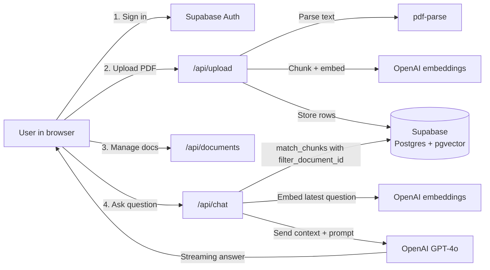
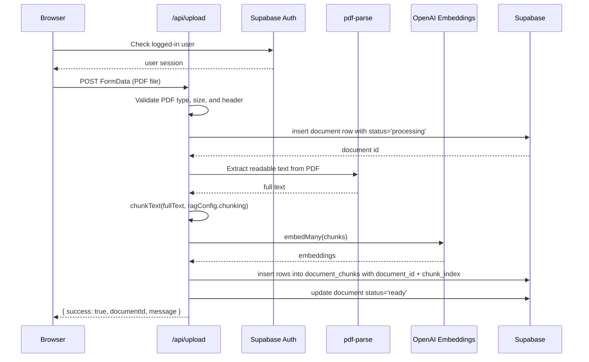
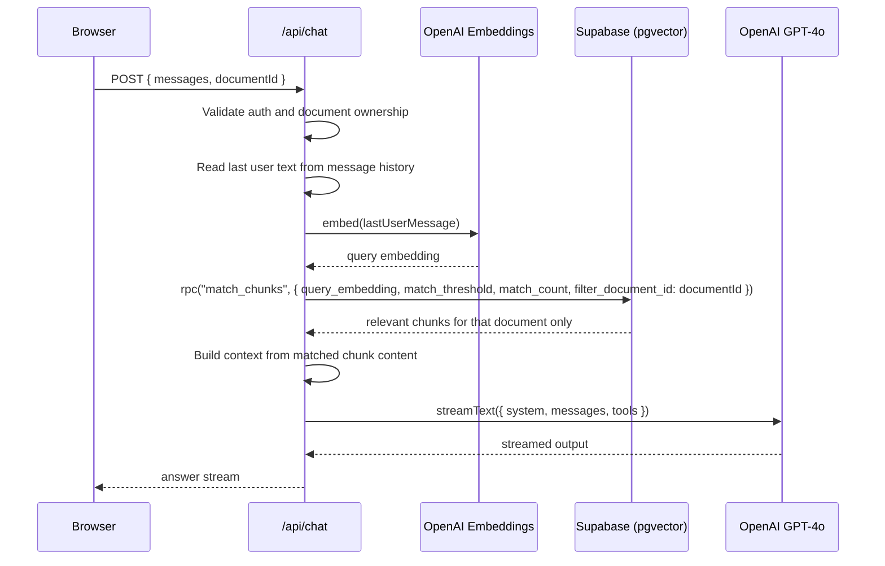

# 📄 Document & Knowledge Assistant

A full-stack RAG app for authenticated PDF Q&A. Users sign in, upload PDF sources, manage a document registry, pick a ready document, and ask questions grounded in that document's indexed content.

---

## 1. The big idea

This app solves a very common AI problem: a model has no knowledge of your private PDF unless you provide it as context. The flow is:

1. A user uploads a PDF.
2. The app extracts the text and splits it into overlapping chunks.
3. Each chunk is converted into an embedding with OpenAI.
4. The chunk + embedding are stored against a specific document in Supabase.
5. When a user asks a question, the app embeds the question and retrieves only the most relevant chunks from the selected document.
6. The AI answers using that retrieved context only.

This keeps the answer grounded to the selected source instead of mixing unrelated documents or general model knowledge.

---

## 2. What changed recently

The current app is no longer a single shared document store. It now includes:

- Supabase Auth-based login flow in the browser UI.
- A per-user document registry with status tracking: `processing`, `ready`, and `failed`.
- A document lifecycle with `documents` and `document_chunks` ownership tied to `user_id`.
- Retrieval filtered to the chosen `documentId` instead of searching across every PDF ever uploaded.
- RAG metadata stored on each document (`rag_config_version`, `chunk_max_size`, `chunk_overlap`, `embedding_model`).
- Evaluation configs for retrieval quality and answer quality in the `evaluation/` directory.
- Cleanup and rename/delete flows for document management.

These changes are implemented across:

- `app/api/upload/route.ts`
- `app/api/chat/route.ts`
- `app/api/documents/route.ts`
- `app/api/documents/[id]/route.ts`
- `supabase/migrations/*.sql`
- `lib/rag-config.ts`
- `evaluation/*.ts`

---

## 3. High-level architecture


```mermaid
flowchart LR
    U["User in browser"] -->|1. Sign in| AUTH["Supabase Auth"]
    U -->|2. Upload PDF| UP["/api/upload"]
    U -->|3. Manage docs| DOCS["/api/documents"]
    U -->|4. Ask question| CH["/api/chat"]

    UP -->|Parse text| P["pdf-parse"]
    UP -->|Chunk + embed| O1["OpenAI embeddings"]
    UP -->|Store rows| DB[("Supabase\nPostgres + pgvector")]

    CH -->|Embed latest question| O2["OpenAI embeddings"]
    CH -->|match_chunks with filter_document_id| DB
    CH -->|Send context + prompt| LLM["OpenAI GPT-4o"]
    LLM -->|Streaming answer| U
```

- Frontend: client-side upload, document registry, and chat UI in `app/page.tsx`
- Backend: Next.js API routes for upload, chat, and document CRUD
- Database: Supabase Postgres with `pgvector` and row-level security

---

## 4. Tech stack

| Layer       | Technology                                         | Why it is used                                            |
| ----------- | -------------------------------------------------- | --------------------------------------------------------- |
| Framework   | Next.js 15                                         | App Router, full-stack routing, server actions/API routes |
| UI          | React 19, Tailwind CSS v4, shadcn/ui               | Chat UI, upload flow, reusable cards and inputs           |
| Auth        | Supabase Auth + `@supabase/ssr`                    | User session handling and per-user document ownership     |
| AI SDK      | Vercel AI SDK + `@ai-sdk/react` + `@ai-sdk/openai` | Streaming chat responses and embedding calls              |
| Models      | `gpt-4o` + `text-embedding-3-small`                | Chat generation and vector embedding                      |
| PDF parsing | `pdf-parse`                                        | Extract text from uploaded PDFs                           |
| Database    | Supabase Postgres + `pgvector`                     | Vector search and document storage                        |
| Validation  | `zod`                                              | Tool/input validation for structured tool calls           |
| Language    | TypeScript                                         | Type safety across client and server                      |

---

## 5. Folder structure

```text
document-assistant/
├─ app/
│  ├─ api/
│  │  ├─ chat/route.ts              → Authenticated chat requests + document-scoped retrieval
│  │  ├─ documents/route.ts         → List documents for the logged-in user
│  │  ├─ documents/[id]/route.ts    → Rename and delete a document
│  │  └─ upload/route.ts            → Validate PDF → parse → chunk → embed → store
│  ├─ globals.css                   → Global styles and theme
│  ├─ layout.tsx                    → App shell metadata and providers
│  └─ page.tsx                      → Main auth + upload + document registry + chat page
├─ components/
│  ├─ auth-form.tsx                 → Sign-in/sign-up UI
│  └─ ui/                           → shadcn/ui primitives
├─ evaluation/
│  ├─ experiments.ts                → Evaluation configurations and summaries
│  ├─ metrics.ts                    → Retrieval and answer quality metrics
│  ├─ fixtures.ts                   → Provider-free evaluation fixtures
│  └─ *.test.ts                     → Metric and experiment tests
├─ lib/
│  ├─ chunking.ts                   → Chunking helpers
│  ├─ rag-config.ts                 → Baseline retrieval and model config
│  ├─ rag-prompt.ts                 → Grounded system prompt builder
│  ├─ supabase.ts                   → Server Supabase clients and auth helpers
│  ├─ supabase-browser.ts           → Browser client helper
│  └─ utils.ts                      → Tailwind class helper
├─ public/                          → Static assets
├─ supabase/migrations/             → Database schema updates and ownership lifecycle
├─ .env.local                       → Secrets; never committed
├─ next.config.ts                   → Next.js config
├─ components.json                  → shadcn/ui config
├─ package.json                     → Scripts and dependencies
├─ vitest.config.ts                 → Test config
├─ README.md                        → Project documentation
└─ tsconfig.json                    → TypeScript config
```

---

## 6. Authentication and document ownership

The app now expects a signed-in Supabase user before upload or chat is allowed.

The main auth flow is:

- User is checked with `getAuthenticatedUser()` on protected routes.
- Requests without a valid session return `401`.
- A `documents` row stores `user_id`.
- Row-level security policies ensure users only see and manage their own documents and chunks.

This prevents one user from searching another user’s documents or deleting unrelated PDFs.

---

## 7. Upload flow

File involved: `app/api/upload/route.ts`


```mermaid
sequenceDiagram
    participant B as Browser
    participant A as /api/upload
    participant U as Supabase Auth
    participant P as pdf-parse
    participant O as OpenAI Embeddings
    participant S as Supabase

    B->>U: Check logged-in user
    U-->>B: user session
    B->>A: POST FormData (PDF file)
    A->>A: Validate PDF type, size, and header
    A->>S: insert document row with status='processing'
    S-->>A: document id
    A->>P: Extract readable text from PDF
    P-->>A: full text
    A->>A: chunkText(fullText, ragConfig.chunking)
    A->>O: embedMany(chunks)
    O-->>A: embeddings
    A->>S: insert rows into document_chunks with document_id + chunk_index
    A->>S: update document status='ready'
    A-->>B: { success: true, documentId, message }
```

Important details:

- The app validates the file is a real PDF and under 10 MB.
- A `documents` row is created immediately with `status: "processing"`.
- If parsing or embedding fails, the app deletes the chunk rows and marks the document as `failed` with an error message.
- Each chunk row stores:
  - `document_id`
  - `chunk_index`
  - `content`
  - `embedding`

---

## 8. Document API

The app exposes authenticated document management endpoints.

- `GET /api/documents` — list the logged-in user’s documents, with `chunk_count`
- `PATCH /api/documents/:id` — rename a document by id
- `DELETE /api/documents/:id` — delete the document and its chunks via cascading foreign key

These are implemented in:

- `app/api/documents/route.ts`
- `app/api/documents/[id]/route.ts`

The frontend document registry supports:

- select a ready document
- rename a document
- delete a document
- show processing/ready/failed status and chunk counts

---

## 9. Chat flow and retrieval

File involved: `app/api/chat/route.ts`


```mermaid
sequenceDiagram
    participant B as Browser
    participant C as /api/chat
    participant O1 as OpenAI Embeddings
    participant S as Supabase (pgvector)
    participant O2 as OpenAI GPT-4o

    B->>C: POST { messages, documentId }
    C->>C: Validate auth and document ownership
    C->>C: Read last user text from message history
    C->>O1: embed(lastUserMessage)
    O1-->>C: query embedding
    C->>S: rpc("match_chunks", { query_embedding, match_threshold, match_count, filter_document_id: documentId })
    S-->>C: relevant chunks for that document only
    C->>C: Build context from matched chunk content
    C->>O2: streamText({ system, messages, tools })
    O2-->>C: streamed output
    C-->>B: answer stream
```

The current retrieval logic is intentionally scoped to one document:

- Chat requests require a valid `documentId`.
- The server checks the document belongs to the signed-in user.
- The document must have `status === "ready"`.
- Retrieval runs through `supabase.rpc("match_chunks", ...)` with a `filter_document_id` parameter.

This is the critical improvement over the earlier single shared index.

---

## 10. Database schema and migrations

The project relies on a Supabase Postgres database with the `pgvector` extension enabled.

The migration chain is:

1. `supabase/migrations/20260924120000_document_lifecycle.sql`
   - creates the `documents` table
   - adds `document_id`, `chunk_index`, and on-delete cascade behavior to `document_chunks`
   - creates the `match_chunks` SQL function with `filter_document_id`
   - removes legacy anonymous chunks without a reliable owner

2. `supabase/migrations/20260924123000_rag_experiment_metadata.sql`
   - adds per-document metadata for rag config version and chunk settings

3. `supabase/migrations/20260925100000_document_ownership.sql`
   - adds `user_id` to documents
   - turns on row-level security for documents and chunks
   - adds policies so users can only access their own data

Core schema shape:

```sql
create table documents (
  id uuid primary key default gen_random_uuid(),
  user_id uuid references auth.users(id) on delete cascade,
  filename text not null,
  mime_type text not null default 'application/pdf',
  file_size bigint not null check (file_size > 0),
  status text not null default 'processing' check (status in ('processing', 'ready', 'failed')),
  error_message text,
  rag_config_version text,
  chunk_max_size integer,
  chunk_overlap integer,
  embedding_model text,
  created_at timestamptz not null default now(),
  updated_at timestamptz not null default now()
);
```

```sql
create table document_chunks (
  id bigint generated always as identity primary key,
  document_id uuid not null references documents(id) on delete cascade,
  chunk_index integer not null,
  content text not null,
  embedding vector(1536) not null
);
```

The retrieval function is shaped like this in the current app:

```sql
create or replace function match_chunks(
  query_embedding vector(1536),
  match_threshold float,
  match_count int,
  filter_document_id uuid
)
returns table (id bigint, content text, similarity float)
language sql stable
as $$
  select
    dc.id,
    dc.content,
    1 - (dc.embedding <=> query_embedding) as similarity
  from document_chunks dc
  where dc.document_id = filter_document_id
    and 1 - (dc.embedding <=> query_embedding) > match_threshold
  order by similarity desc
  limit match_count;
$$;
```

---

## 11. Frontend behavior

The main page in `app/page.tsx` contains:

- sign-in state for the authenticated user
- upload form for PDF ingestion
- document registry with rename/delete controls
- selected document state for RAG chat
- live chat with `useChat` from `@ai-sdk/react`
- summary-card tool rendering when the model calls `getSummaryCard`

The upload panel shows a loading state while indexing, then a success or failure message. The chat form is disabled until a selected document is ready.

---

## 12. RAG configuration and evaluation

The baseline RAG configuration lives in `lib/rag-config.ts`:

| Parameter           | Baseline                 |
| ------------------- | ------------------------ |
| Chunk size          | 500                      |
| Overlap             | 50                       |
| Embedding model     | `text-embedding-3-small` |
| Retrieval threshold | 0.3                      |
| Retrieved chunks    | 4                        |
| Prompt variant      | `baseline`               |
| Chat model          | `gpt-4o`                 |

The project includes evaluation experiments for multiple variants:

- `baseline-v1`
- `strict-grounding-v1`
- `focused-retrieval-v1`

These are defined in `evaluation/experiments.ts` and measured in `evaluation/metrics.ts`.

The metrics cover:

- retrieval hit@k
- recall@k
- reciprocal rank
- empty results
- false positives
- groundedness
- factual correctness
- refusal behavior for unsupported answers

Run the deterministic checks with:

```bash
npm run evaluate
```

> Live-model judging is intentionally separated from the normal test workflow and should only be used in a separately gated experiment.

---

## 13. Environment variables

Create a `.env.local` file at the project root with:

```env
OPENAI_API_KEY=sk-...
NEXT_PUBLIC_SUPABASE_URL=https://xxx.supabase.co
NEXT_PUBLIC_SUPABASE_ANON_KEY=eyJ...
SUPABASE_SERVICE_ROLE_KEY=sb_secret_...
```

Notes:

- `OPENAI_API_KEY` is used for embeddings and GPT chat completions.
- `NEXT_PUBLIC_SUPABASE_URL` is used by the browser and server clients.
- `NEXT_PUBLIC_SUPABASE_ANON_KEY` is used for browser-authenticated requests.
- `SUPABASE_SERVICE_ROLE_KEY` must stay on the server and must never be exposed to the browser.

---

## 14. Running the project

```bash
npm install
npm run dev
```

Then open:

- http://localhost:3000

Useful scripts:

```bash
npm run build
npm run start
npm run lint
npm test -- --run
npm run evaluate
```

---

## 15. Key concepts explained

- RAG: retrieve relevant document chunks and feed them into the model before generating a response.
- Embedding: numeric representation of meaning for a text snippet.
- Chunking: splitting long text into smaller overlapping pieces for better retrieval and context use.
- pgvector: Postgres extension for vector similarity search.
- Cosine similarity: measure of how close two vectors are in meaning space.
- Streaming: showing model output token by token as it is generated.
- Tool calling: letting the model call a structured tool such as a summary card.
- System prompt: hidden instructions that steer the model toward grounded answers exclusively from the provided context.

---

## 16. Known limitations

- Document indexing is still limited to PDF files.
- Auth is required, but there is no multi-tenant admin layer beyond per-user ownership.
- Uploaded documents are not versioned or re-indexed from the UI by default; they are managed through file upload and CRUD APIs.
- Errors are intentionally surfaced in a user-friendly way rather than exposing raw database internals.
- The app currently assumes one active document selection per chat session.

---

## 17. Suggested next steps

If you want to extend the app further, the most natural next steps are:

- add document preview or page-level extraction stats
- support OCR or DOCX ingestion in addition to PDFs
- add multi-document comparison and cross-document search
- build a quality dashboard from evaluation summaries
- add background indexing jobs for larger files

This project is intentionally small and practical: it demonstrates a grounded, document-scoped RAG system with real user ownership, indexing, retrieval, and evaluation in one codebase.
